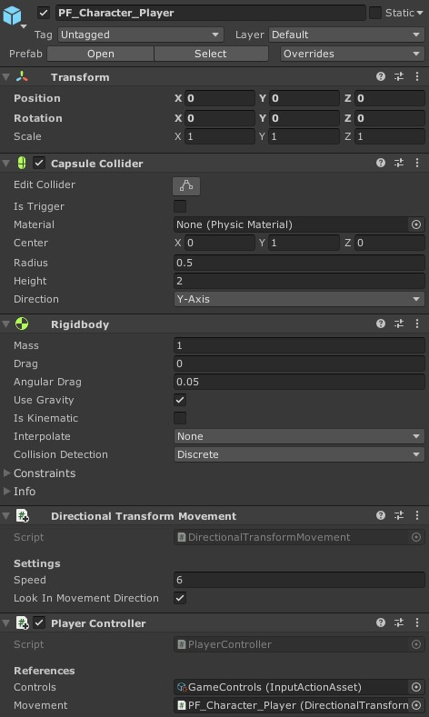

# Unity Project: Survival Adventure - Documentation - Player features

All features relative to the player are in directory `/Assets/_GAME/_FINAL/Characters/Player`.

This directory contains the main Player prefab, and the player-exclusive components.

## Components

- [`PlayerController`](./player-controller.md): The player controller, which binds actions to game inputs, and aggregate the different player actions components

## The Player prefab

The player prefab in this directory is a *Prefab Variant* from the base character prefab. It has all player components already setup, so you can just put it in an empty scene and start playing with it!

