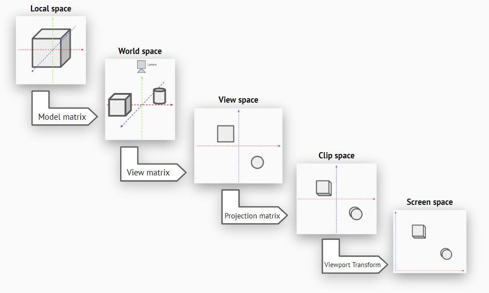

# Unity Project: Survival Adventure - Documentation - Shaders

This documentation expose the theory behind shaders, with practical examples in Unity.

## What is a shader?

A shader is a program executed by the graphics card during a rendering process. As an example, if there's a 3D model of a cube in your scene, Unity will ask the graphics card to render that "raw" 3D model, and execute the shader after the geometry has been computed. Then, the shader can add colors, transparency, displacements, ...

### Requirements

If you don't use a nodal interface like *Shader Graph* or a simplified scripting tool for shaders, you'll need to have a good mathematics knowledge (especially with vectors and trigonometry). And since there's several languages to script shaders, each one have its own syntax and functions.

### Languages and shaders scripting

Generally, shaders are developped with GLSL (OpenGL), HLSL (DirectX) or CG (NVidia).

In the case of Unity, it supports all of them, but these languages are used into another, which is *ShaderLab*. This language is exclusive to Unity, and is meant to make the shaders scripting easier. It also allow vertex and fragments shaders to have one or more "passes", meaning that all vertices and pixels are processed once, then we can process them again. It can be useful for example to do blurring effects, where you need to know which color the pixels have around the processed one.*

*ShaderLab* also allow to use *subshaders*. You can define several shaders (maybe using different language each time), and Unity will read the first of the list that can be executed on the device.

[=> See the official Shader Lab documentation for more informations](https://docs.unity3d.com/Manual/SL-Shader.html)

### Other types of shaders

A special kind of shader, the *Compute shaders*, are designed to do calculations using the graphics card. This is extremely useful to perform simple operations on a big amount of data.

In the cas eof Unity, it has a special type of shader, *Surface shaders*, which are basically a pre-configured shader that will do lighting and reflection calculations for us.

## The render pipeline

Before going further into shaders applications, you must understand the render pipeline of a rendering engine. The following explanations are not exclusive to Unity: the pipeline is generally the same for other rendering engines like in Blender, Maya, Unreal Engine, ... Some engines can have some more steps, but they won't be covered here.

Here are the common render pipeline steps of a rendering engine:

- **Vertices extraction** (not exposed): Read the geometry of the object to render
- **Vertex shader**: Program that defines the values to store for each vertex (position, color, ...)
- **Teseellation**: Mesh subdivision from the graphics card, so the mesh can have a better definition
- **Geometry shader**: Program that allow you to add, move or remove vertices on the rendered mesh
- **Rasterization** (not exposed): Conversion from a vector image (plain 3D coordinates) into a "pixel" image
- **Fragment shader**: Program called for each rendered pixel, which allow you to change the pixels aspects before they are rendered
- **Frame buffer** (not exposed): Collects the processed pixels to create the final *frame* to render

Note that some steps are marked *not exposed*. It means that you can't manipulate the rendering pipeline at this step, it's the internal graphics card's work.

### Vertices extraction

In render processes, a vertex is not only a vertex at its *geometric* definition. That structure contains a position, but can also contain other data such as: colors, normals, texture UV coordinates, custom values, ... And these data are what is send as input to the graphics card.

### Vertex shader

The vertex shader is a program that uses the vertex data (from the previous step), and can alterate them. At this step, you can for example change the normal or a mesh face, the color of a vertex, etc..

Note that in shaders, values are automatically interpolated. For example, on a triangle, if a vertex is yellow and another is red, the values will be interpolated, and the color at halfway between those points will be orange.

### Tessellation

The tessellation process will subdivide the triangles of a mesh. It means that, by just using shaders (and so, using the graphics card and not the processor), you can send a very low resolution sphere with visible sharp edges, and turn it into a high res model with tessellation and displacement (which you can do in the next step).

In the case of Unity, this operation can be done in a *Surface Shader*, which is basically a pre-configured shader that will do lighting and reflection calculations for us.

### Geometry shader

The Geometry shader is a program that will allow you to generate or remove points of the rendered mesh, or even move them to create new shapes. This is for example very useful if you want to create waves for a water shader, and so deform the input mesh to emulate that behavior.

Since the geometry shader takes points, lines or faces as input, it can be used for rendering particles. These particles are just points, the geometry shader converts these points into faces or complex shapes, and apply a color or a texture on it. This process make particles extremely lightweight for the processor, even with a ton of particles to render!

There is also a big difference between a tessellation shader and a geometry shader. Both can be used to subdivide a mesh, but only the geometry shader is able to create new faces that doesn't exist on the input mesh. The tessellation shader will just add subdivisions inside the existing mesh.

### Rasterization

You can't do anything on the rasterization step: this is all done by the graphics card. This step will convert a vector image (with 3D coordinates) into *pixel* image (with screen coordinate).

### Fragment shader (or Pixel shader)

The fragment (or pixel) shader is a program called for each pixels to render. This can be used to change the final color of a pixel, its depth (and so making objects that are placed in the background in your scene appear at the foreground), ...

## 3D Transformations

In shader programs, you don't directly get the screen position of a vertex (except for fragment shader), but you have access to vector data. It means that you can do basic operations such as changing colors very easily, but if you need to take account of the exact position of the rendered 3D model in the scene, you'll need to use transformation matrices.

These transformation matrices are generally pre-defined by the engine.

Here is a little scheme of the transformation processes:

As you can see in this scheme, each coordinate system will be multiplied by a transformation matrix to get the next coordinate system. Using these allow you, for example, to make an object be green when on the left of the screen, and become more and more red when it moves to the right of the screen.

- **Local space**: coordinates system based on the pivot of the rendered object
- **World space**: coordinates system based on the (0; 0; 0) position of the scene
- **View space**: coordinates system based on the center of the camera view (no perspective)
- **Clip space**: same as view space, except it processes the perspective of the camera view. Note taht, at this step, the render process is able to ignore faces or even models that are out of the view, and so speed up the computations
- **Screen space**: coordinates system based on the screen bottom-left corner

In shaders, the values are generally normalized. It means that for example in a screen space, the left side is 0 on X, and the right side is 1 on X, whatever the size of the screen.

## Textures

Textures are used in a lot of cases with shaders. Usually in rendering naming, we call them maps. You can use textures to just render color, define the normals of an object (and so tell the lighting engine how light should reflect on the object), use gradients, define which area of the object should emit lights (emission map), etc.

Texture coordinates are written "UVs" (where U is the X position on the texture, and V is the Y position). You should be familiar with it if you use 3D modeling softwares. On 3D models, we use UVs to define which color on a texture is applied on which area of an object.

There's some common maps used in video games:

- *Albedo*, *Diffuse* or *Base* map (the name can change depending on the software): Contains the base color informations of a model
- *Normal* map: alterate the normals of an object, and so define how the lights are reflected on the model
- *Emission* map: defines the areas and the colors of the lights that can be emitted from the model
- *Displacement* or *Height* map: deforms the original mesh of the 3D model
- *Noise* map: used to generate pseudo-random effects
- *Ramp* maps: generally 1D textures, used for certain effects (e.g. gradients)

## Buffers

The buffers store specific data during the process of rendering a scene, and group them together to generate the final frame. There's several rendering modes (deffered, forward, ...), and they all have their specific buffers.

In the case of deffered rendering, there's a buffer for the colors, one for the normals, and one for the depth.

### Stencils

Unity uses a special kind of rendering buffer: the *Steincil buffer*. It allow you to create masks, and make objects or only some area of them appear or disappear as you decide. This can be used with two shaders: one will act as the mask, and the other one is the object which you want to show/hide.

See the [Stencil shader documentation](./List/stencils.md) to learn more about its implementation.

## References and documentations

- [The Book of Shaders (FR)](https://thebookofshaders.com)
- [Shadertoy](https://www.shadertoy.com)
- [Catlike coding](https://catlikecoding.com/unity/tutorials/)
- [Shader Laboratory](http://www.shaderslab.com/shaders.html)